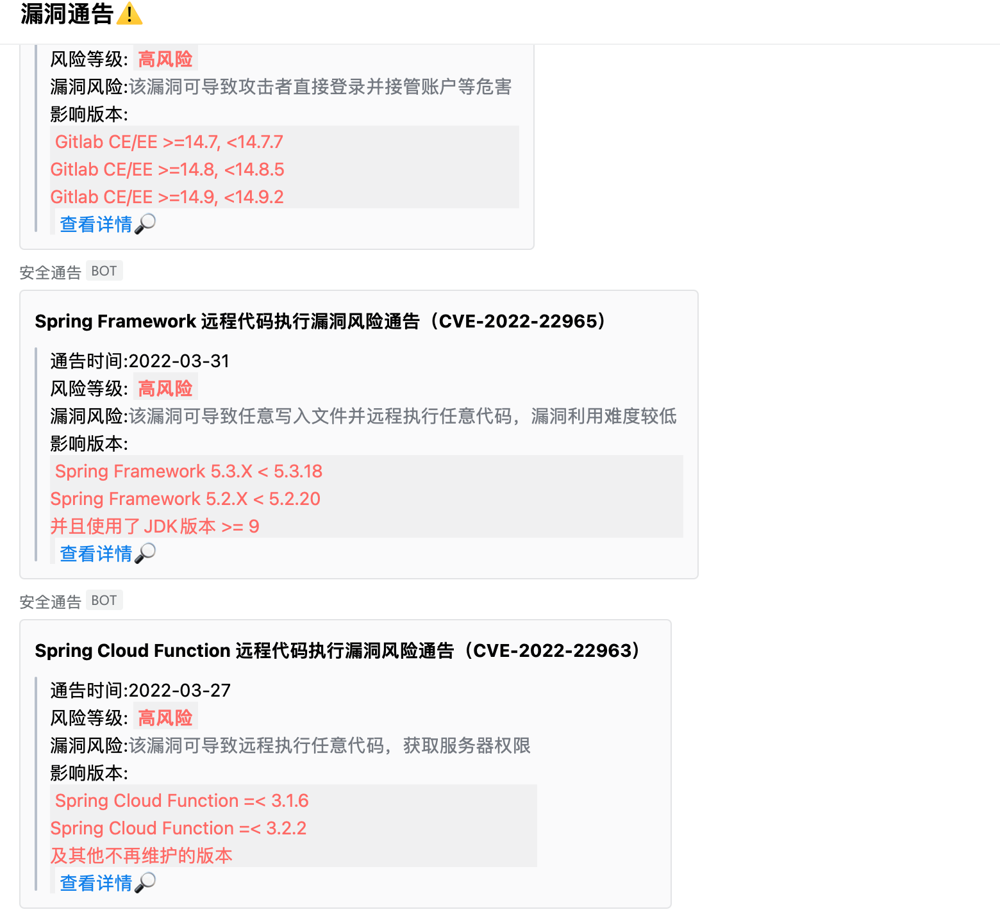

# VulTg
**新增安全漏洞时，及时通过机器人🤖️进行通知**


#### 0x01 背景介绍：

​	做为安全服务人员需要对客户资产做好管控，在出现新漏洞的时候及时通报并进行核查。

#### 0x02 使用方法：

##### 1. 利用企业微信机器人🤖️

可以直接在公司群内新建，或者自行申请1个企业微信号
<br />

##### 2. 更改代码中的webhook_addr地址


##### 3. 服务器部署定时服务

```
$ crontab -e
$ 0 9,13,16,20 * * * python3 /tmp/VulTg.py
```

##### 4. 效果展示
PC端



手机端


